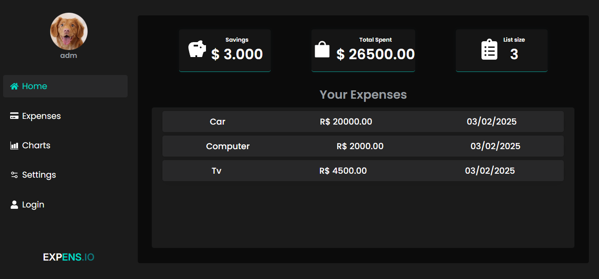
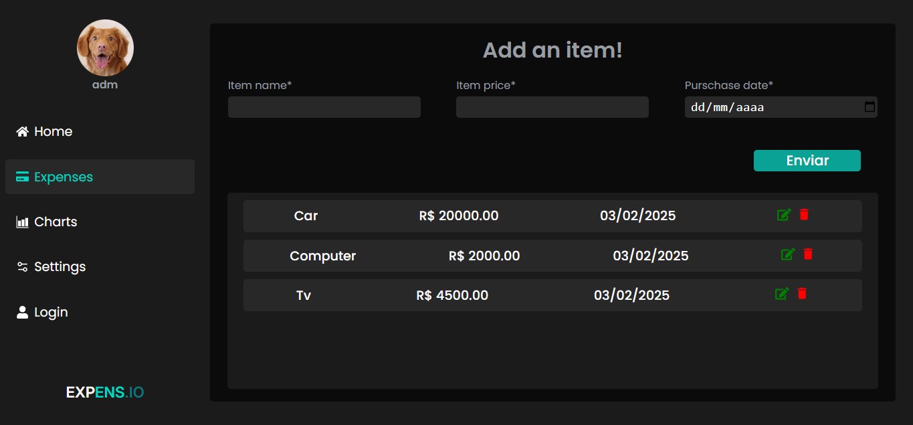
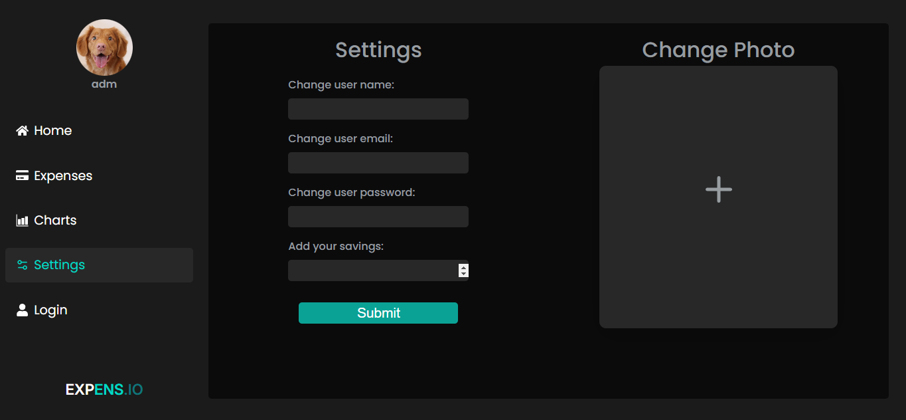
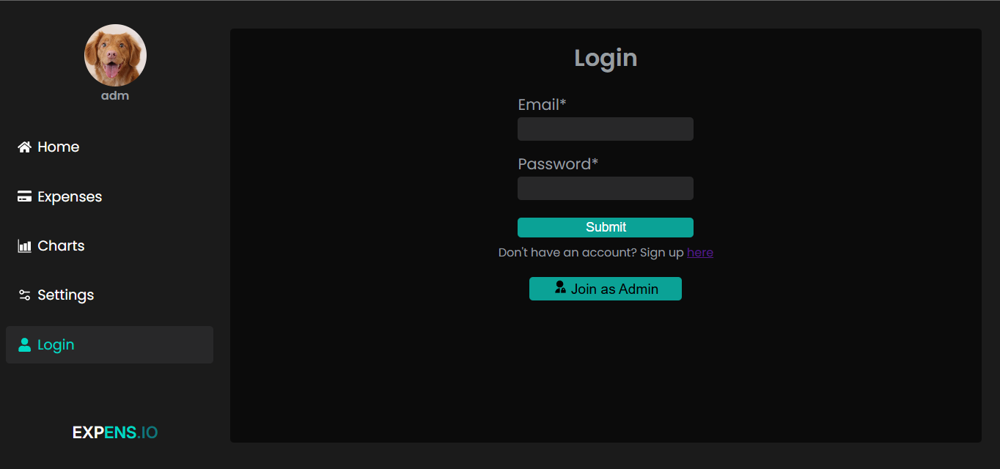

# Expens.io
> [!NOTE]
> **Neste diretório estão apenas os arquivos frontend do projeto, caso tenha interesse no backend dê uma olhada [aqui!](https://github.com/LeiPinheiro/Expens.io-API)**

***Expens.io*** é uma plataforma de controle de despesas, criada para ajudar as pessoas a organizarem e gerenciarem sua vida financeira de maneira mais eficiente e prática. 

**Link do site:** https://expens-io.vercel.app


## 🚀 Tecnologias Usadas
* **Frontend:** React
* **Backend:** Node.js, Express
* **Banco de Dados:** PostgreSQL
* **Autenticação:** JWT
* **Outras bibliotecas:** React router, React icons, Recharts

## ⚙️ Funcionalidades
* **Login e registro**: Usuários podem logar e se registrar
* **Edição de dados**: Usuários podem editar email, senha e nome caso precisem
* **Foto de perfil**: Cada usuário pode colocar e editar sua própria foto de perfil
* **CRUD de despesas**: Usuários podem editar nome, preço e data de compra de uma despesa, também podem apagar
* **Analisar despesas**: Também é possível visualizar gastos em gráficos

## 📦 Instalação

### Requisitos

- **Node.js** Feito na versão v20.18.0
- **PostgreSQL** Banco de dados feito com o postgres 16

### Passos

1. **Clone o repositório:**

   ```bash
   git clone https://github.com/LeiPinheiro/Expens.io.git
3. **Navegue para o diretório do projeto:**

    ```bash
   cd expense.io-app
5. **Instalando dependências:**

   ```bash
   npm install

6. **Inicie o servidor**

   ```bash
   npm run dev

## Fotos do projeto





